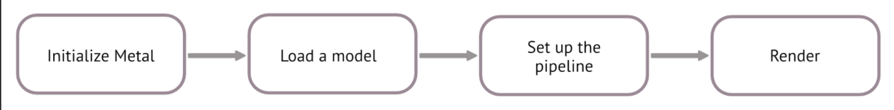
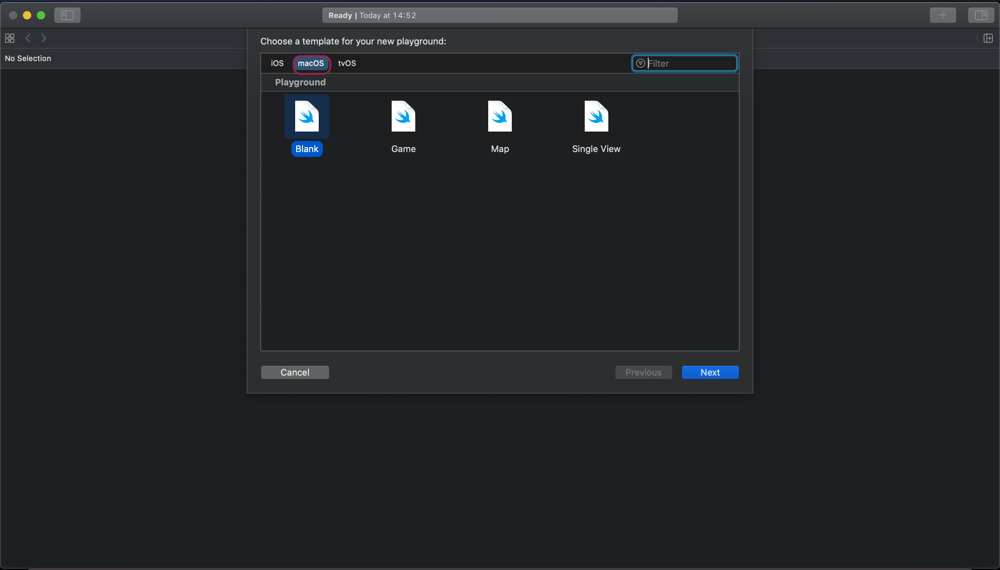
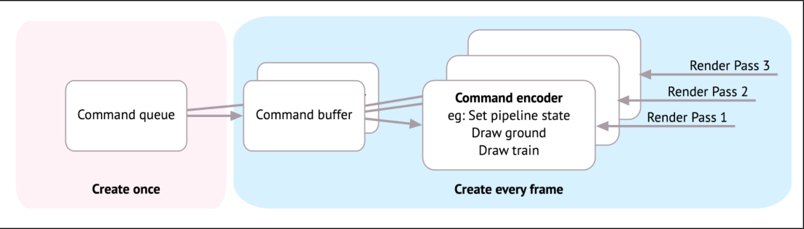
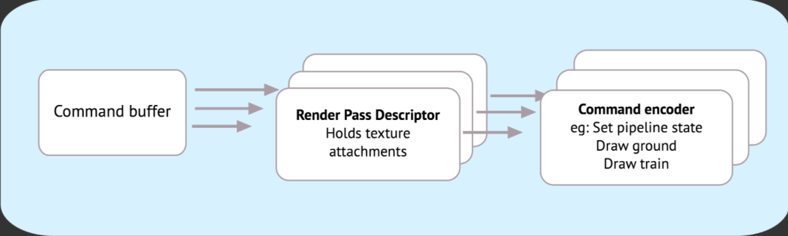

# Metal by Tutorial, Second Edition, Swift 5.1, iOS 13, XCode 11

# Section 1. The Player

렌더링이란
* 렌더링이란 한 이미지의 표면을 3차원으로 가득차게 만드는 '쉐이딩'작업과 색상을 처리하는 작업을 말한다
* 3D 이미지를 렌더링하는 많은 방법들이 있지만 일반적으로 블렌더나 마야 같은 도구로 모델링을 하는 것에서 시작한다
  - 블렌더나 마야로 만들어진 모델들은 버텍스들로 구성되어 있다
  - 버텍스는 3차원의 점(x, y, z)을 말한다
  - 3D 모델은 이 버텍스들을 연결해 만든 수많은 선, 삼각형 등의 집합체다
* 3D 렌더러는 3D 모델를 받아 모델에 있는 버텍스의 리스트를 해석한다
* 해석한 데이터를 GPU로 보내 최종 이미지, 텍스쳐를 만든다
* 만들어진 결과물은 다시 CPU로 되돌려보내지고 스크린에 보여준다
* 최종이미지를 구성하는 버텍스, 머터리얼, 빛과 같은 데이터들을 렌더링하는 이 과정을 '렌더링 파이프라인'이라고 한다

렌더링 파이프라인
* 파이프라인은 결과물에 직접 영향을 끼칠 수 있는 프로그래밍이 가능한 함수와 그렇지 않은 함수를 모두 가지고 있다
* 프로그래밍이 가능한 함수는 버텍스 함수다
* 프로그래밍이 가능하지 않은 함수는 프래그먼트 함수다
* 버텍스 함수와 프래그먼트 함수의 자세한 내용에 대해서는 앞으로 배워볼 것이다

프레임이란
* 우리가 게임을 할 때 게임의 캐릭터가 역동적으로 움직이는 것처럼 보이는 건 GPU가 초당 60번 렌더링 해주기 때문이다
* 60번 렌더링 되는 각각의 스틸 이미지를 프레임이라 하며 이미지들이 나타나는 속도를 프레임 레이트라 한다
  - 만약 게임을 하는 도중에 캐릭터가 버벅거리며 움직인다면 대개 프레임 레이트의 감소 때문일 것이다
* 게임처럼 3D 렌더링이 필요한 프로그램을 만들 때는 성능을 위해 GPU가 충분히 처리할 수 있는 코드를 작성하기 위한 노력이 필요하다

첫 번째 메탈 앱
* 아마 첫 메탈 앱을 만들 때는 평평한 구와 같은 단순한 도형만을 그리게 될 것이다
* 이는 처음부터 복잡한 원근법, 쉐이딩을 처리하기는 어렵기 때문이다
* 하지만 이런 단순한 도형도 복잡한 모델과 똑같이 모든 3차원 정보를 가지고 있다
* 메탈은 렌더링 과정에서 모델이 얼마나 사이즈가 크든, 복잡하든 상관없이 같은 방식으로 모델을 렌더링한다



## 앱을 생성하기


* Xcode를 실행하고 File -> New -> Playground를 눌러 macos에 있는 Blank 템플릿을 선택한다

## 모듈을 임포트하기

```swift
import PlaygroundSupport
import MetalKit
```
* PlaygroundSupport는 assistant editor에서 라이브 뷰를 볼 수 있게 해주는 모듈이다
* MetalKit은 메탈을 보다 쉽게 사용할 수 있게 해주는 모듈이다
* MetalKit은 MTKView라는 커스터마이즈된 뷰를 가지고 있다
* MTKView는 텍스쳐 로딩, 메탈 버퍼작업, Model I/O 같은 다른 프레임워크와 연결해주는 인터페이스 등 많은 편의 메서드들을 제공한다

## GPU를 사용할 수 있는지 다비아스 체크하기

```swift
guard let device = MTLCreateSystemDefaultDevice() else {
  fatalError("GPU is not supported")
}
```
* 위 코드를 입력하고 플레이그라운드를 실행해보자
* 만약 에러가 발생한다면 macos앱이 아닌 iOS로 플레이그라운드를 생성하지는 않았는지 체크해보자
* macos로 생성했음에도 에러가 발생한다면 GPU를 지원하지 않고 있을 가능성이 있다

## 뷰를 세팅하기

```swift
let frame = CGRect(x: 0, y: 0, width: 600, height: 600)
let view = MTKView(frame: frame, device: device)
view.clearColor = MTLClearColor(red: 1, green: 1, blue: 0.8, alpha: 1)
```
* 메탈 렌더러를 사용하기 위해 MTKView를 만드는 코드다
* MTKView는 macOS에서는 NSView의 iOS에서는 UIView의 서브클래스다
* MTLClearColor는 RGBA 값을 가진다
* 컬러는 뷰의 clearColor에 저장되어 뷰의 색상을 지정하는 데 사용된다

## 모델

Model I/O
* Model I/O는 메탈과 SceneKit을 연결시켜주는 프레임워크다 
* 주된 목적은 블렌더나 마야로 만들어진 3D 모델들을 로드하고 쉽게 렌더링할 수 있도록 데이터 버퍼에 설정하는 것이다
* 3D 모델을 직접 로드하는 대신 원시값(primitive)이라 불리는 Model I/O의 기본 도형을 로드할 수 있다
* 원시값은 일반적으로 cube, sphere, cylinder, torus 같은 도형들이다

```swift
// 1
let allocator = MTKMeshBufferAllocator(device: device)
// 2
let mdlMesh = MDLMesh(sphereWithExtent: [0.75, 0.75, 0.75],
                      segments: [100, 100],
                      inwardNormals: false,
                      geometryType: .triangles,
                      allocator: allocator)
// 3
let mesh = try MTKMesh(mesh: mdlMesh, device: device)
```
1. allocator는 메쉬 데이터의 메모리를 관리한다
2. Model I/O는 특정 사이즈의 구를 만들어 데이터 버퍼에 모든 버텍스 정보를 포함하고 있는 MDLMesh를 리턴한다
3. 메탈이 메쉬를 사용할 수 있게끔 Model I/O 메쉬를 MetalKit 메쉬로 변환한다

## 큐, 버퍼, 인코더

렌더 커맨드 인코더
* 각 프레임은 GPU에 보내는 커맨드들로 구성되어 있다
* 프로그래머는 이 커맨드들을 렌더 커맨드 인코더로 래핑한다
* 커맨드 버퍼는 이 커맨드 인코더들을 정리하고 커맨드 큐는 커맨드 버퍼를 정리한다. 
  - 커맨드 큐 -> 커맨드 버퍼들 -> 커맨드 인코더들(래핑된 커맨드들)



구체적으로는 아래의 코드로 커맨드 큐를 만들 수 있다

```swift
guard let commandQueue = device.makeCommandQueue() else {
  fatalError("Could not create a command queue")
}
```
* 반드시 앱을 시작할 때 디바이스와 커맨드 큐를 설정해야 한다 
* 그리고 한 번 설정된 디바이스와 커맨드 큐는 일반적으로 반복해서 사용한다
* 각 프레임에서 한 개의 커맨드 버퍼와 한 개 이상의 렌더 커맨드 인코더를 생성하게 될 것이다
  - 이것들은 쉐이더 함수나 파이프라인 상태와 같은 다른 객체를 가르키는(point) 경량 오브젝트들이다 
  - 이것들도 앱을 시작할 때 단 한번만 생성한다

## 쉐이더 함수

쉐이더 함수
* 쉐이더 함수는 GPU에서 실행되는 작은 프로그램들이다
* 프로그래머는 C++의 서브셋인 Metal Shading Language로 쉐이더 함수를 작성해야 한다
* 일반적으로 쉐이더 함수는 .metal 확장자로 된 개별 파일에 작성한다
  - 지금은 플레이그라운드에서 간편하게 멀티라인 문자열로 테스트해볼 것이다

```swift
let shader = """
#include <metal_stdlib> 
using namespace metal;

struct VertexIn {
  float4 position [[ attribute(0) ]];
};

vertex float4 vertex_main(const VertexIn vertex_in [[ stage_in ]]) {
  return vertex_in.position;
}

fragment float4 fragment_main() {
  return float4(1, 0, 0, 1);
}
"""
```

버텍스 함수와 프래그먼트 함수

```swift
let library = try device.makeLibrary(source: shader, options: nil)
let vertexFunction = library.makeFunction(name: "vertex_main")
let fragmentFunction = library.makeFunction(name: "fragment_main")
```
* 버텍스 포지션을 다루는 버텍스 함수를 vertex_main이라는 이름으로 지정한다
* 픽셀 컬러를 다루는 프래그먼트 함수를 fragment_main이라는 이름으로 지정한다
* 메탈 라이브러리는 이 두 함수를 포함하고 있다
* 컴파일러는 이 두 함수를 체크하고 파이프라인 디스크럽터에서 사용할 수 있게 만들어줄 것이다

## 파이프라인 상태

pipeline state
* 메탈에서 프로그래머는 GPU를 위해 파이프라인 상태를 설정해야 한다
* 이 상태를 이용해 프로그래머는 GPU에 어떤 상태가 변경되기 전까지는 아무 것도 변경되지 않을 것임을 전달할 수 있다
* 고정된 상태의 GPU에서 프로그램은 보다 효율적으로 실행된다
* 파이프라인 상태는 사용해야 하는 픽셀 포맷, 렌더링 해야하는 깊이와 같이 GPU가 필요로하는 정보들을 포함하고 있다
* 또한, 프로그래머가 생성한 버텍스 함수와 프래그먼트 함수도 가지고 있다
* 파이프라인 상태는 직접 만들지 않고 디스크립터를 통해 생성한다
* 디스크립터는 파이프라인이 알고 싶어하는 모든 것을 가지고 있다
* 프로그래머는 특정한 렌더링 상황에 필요한 프로퍼티들을 변경해주기만 하면 된다

```swift
let pipelineDescriptor = MTLRenderPipelineDescriptor()
// 1
pipelineDescriptor.colorAttachments[0].pixelFormat = .bgra8Unorm

// 2
pipelineDescriptor.vertexFunction = vertexFunction
pipelineDescriptor.fragmentFunction = fragmentFunction

// 3
pipelineDescriptor.vertexDescriptor = 
     MTKMetalVertexDescriptorFromModelIO(mesh.vertexDescriptor)
```
1. 32비트 컬러 픽셀이 되도록 픽셀 포맷을 설정한다
2. 두 개의 쉐이더 함수도 설정한다
3. 버텍스 디스크립터를 이용해 버텍스가 메모리에서 어떻게 배치되는지를 GPU에 알린다
  - Model I/O는 스피어 메쉬가 로드되었을 때 자동적으로 버텍스 디스크립터를 만든다

디스크립터로부터 파이프라인 상태를 만들기 
* 이제 파이프라인 디스크립터의 설정을 완료했다
* 지금까지 설정한 정보들 외에도 MTLRenderPipelineDescriptor에는 다른 프로퍼티들이 많이 있다
* 지금은 메탈의 파이프라인을 이해하기 위한 것이므로 기본적인 설정들만 사용한다
* 다음 코드로 디스크립터로부터 파이프라인 상태를 만들 수 있다

```swift
let pipelineState = 
  try device.makeRenderPipelineState(descriptor: pipelineDescriptor)
```
* 파이프라인 상태를 만드는 것은 처리 시간의 효율을 높여준다
* 지금은 하나의 파이프라인 상태만 만들었지만, 실제 앱에서는 여러 파이프라인 상태를 만들어 다른 쉐이딩 함수를 호출하거나 다른 버텍스 레이아웃들을 사용하게 될 것이다

## 렌더링

지금까지의 작업을 통해 코드는 매 프레임마다 작동한다. MTKView가 프레임마다 코드를 실행하는 메소드를 가지고 있기 때문이다. 하지만 단순히 정적인 뷰를 렌더링하는 것이라면 매 프레임마다 갱신할 필요는 없다. 그래픽 렌더링 작동시 GPU의 궁극적인 작업은 3D 씬에서 단일 텍스쳐 결과물을 만드는 것이다. 이 텍스쳐는 물리 카메라의 디지털 이미지와 유사하다. 이 텍스쳐는 디바이스 스크린에 매 프레임마다 표시될 것이다.

### 렌더 패스

현실감있는 렌더링을 달성하려면 그림자, 빛, 반사를 계산해야 한다. 이것들은 많은 계산이 필요하며 각각의 렌더 패스를 가지고 있다. 예를 들어, 그림자 렌더 패스는 3D 모델들 전체에 렌더링되지만, 그림자 정보 크기만을 다룬다. 그 다음 렌더패스는 모델들 전체의 색상을 다룬다. 그 결과 그림자와 색상이 조합된 최종 텍스쳐가 스크린에 렌더링된다



MTKView는 렌더 패스 디스크립터를 제공한다. 렌더 패스 디스크립터는 drawable이라 불리는 텍스쳐를 가지고 있다.

```swift
// 1
guard let commandBuffer = commandQueue.makeCommandBuffer(),
// 2
  let renderPassDescriptor = view.currentRenderPassDescriptor,
// 3
  let renderEncoder = commandBuffer.makeRenderCommandEncoder(descriptor:
	renderPassDescriptor)  
else { fatalError() } 
```
1. 커맨드 버퍼를 만든다. 커맨드 버퍼에는 GPU를 실행하는 커맨드들을 저장한다
2. 뷰의 렌더 패스 디스크립터의 참조를 얻는다. 디스크립터는 최종 렌더링에 필요한 attachments라고 불리는 데이터를 가진다. 각 attachment는 텍스쳐를 저장 혹은 유지할 정보를 필요로한다. 렌더 패스 디스크립터는 렌더 커맨드 인코더를 생성하는데 사용되곤 한다.
3. 커맨드 버퍼로부터 렌더 패스 디스크립터를 사용해서 렌더 커맨드 인코더를 얻는다. 렌더 커맨드 인코더는 GPU에서 버텍스들을 그릴 모든 정보들을 가지고 있다

만약 시스템이 커맨드 버퍼나 렌더 인코더 같은 메탈 객체를 생성하는데 실패하면 fatal error가 발생한다. 뷰의 currentRenderPassDescriptor는 특정 프레임에서 작동하지 않을 수도 있고, 렌더링 델리게이트 메소드를 리턴만하게 될 것이다.

```swift
renderEncoder.setRenderPipelineState(pipelineState)
```
* 이 코드는 렌더 인코더에 앞서 세팅해둔 파이프라인 상태를 준다

```swift
renderEncoder.setVertexBuffer(mesh.vertexBuffers[0].buffer, 
                              offset: 0, index: 0)
```
* 앞서 세팅해둔 구 메쉬는 단순한 버텍스들의 리스트를 포함하고 있는 버퍼를 가지고 있다. 이 메쉬의 버퍼를 렌더 인코더에 넘겨주자
* offset은 버퍼에 있는 버텍스 정보가 시작하는 위치를 지정하는 속성이다
* index는 GPU 버텍스 쉐이더 함수가 어떻게 이 버퍼를 찾는데 사용되는 속성이다

### 서브 메쉬
5/2 작성

## 챌린지